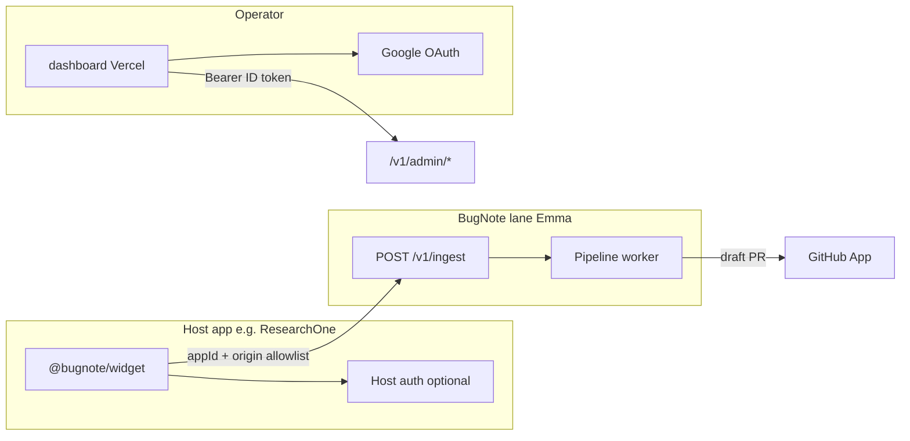

# BugNote — host app integration plan

**Prereq:** PR #5 merged (Google OAuth dashboard) and Emma/Vercel env aligned with [Document 3](../BugNote-Doc3-Deployment-Guide.md).

BugNote is **not** embedded in each app's auth. The widget tags reports with the host app's user id; the **review dashboard** is a separate Vercel app for the operator only.

## Architecture



## Per-app checklist (repeat for each product)

| Step | Owner | Action |
|------|--------|--------|
| 1 | You | Pick stable `appId` (e.g. `researchone`, `newontology`) |
| 2 | You | Add production origin to `INGEST_ALLOWED_ORIGINS` on Emma → redeploy |
| 3 | You | Add `"appId":"GooseyPrime/<repo>"` to `GITHUB_APP_REPO_MAP` if you want draft PRs |
| 4 | Host app | Install widget (React or UMD) pointing at `https://api.bugnote.intellme.com/v1/ingest` |
| 5 | Host app | Optional: `getUserId={() => yourUser?.id}` — **host** auth only |
| 6 | You | Smoke: submit report → see in dashboard at `https://bugnote-intellme.vercel.app` |

## Integration by host type

### React SPA (ResearchOne)

```bash
npm i @bugnote/widget
```

```tsx
import { BugNoteProvider } from "@bugnote/widget/react";

<BugNoteProvider
  appId="researchone"
  endpoint="https://api.bugnote.intellme.com/v1/ingest"
  getUserId={() => clerkUser?.id}  // ResearchOne's Clerk — not BugNote auth
>
  <App />
</BugNoteProvider>
```

### Static / non-React (thenewontology.life)

```html
<script src="https://unpkg.com/@bugnote/widget/dist/bugnote.umd.js"></script>
<script>
  BugNote.init({
    appId: "newontology",
    endpoint: "https://api.bugnote.intellme.com/v1/ingest",
  });
</script>
```

### Future apps (template)

1. New `appId` in Emma env + GitHub repo map.
2. Same widget install pattern; use host's own user id callback if available.
3. Do **not** add BugNote login to host apps — operators use the shared dashboard only.

## Suggested rollout order

1. **ResearchOne** — React provider + `getUserId` + `GITHUB_APP_REPO_MAP` entry (already documented in Doc 3 §6).
2. **thenewontology.life** — UMD snippet; confirm origin in allowlist.
3. **Additional Intellme apps** — one PR per host repo for widget wiring only; BugNote server config change in `bugnote` repo (env secret) per app.

## Verification per app

- [ ] Widget loads; ring buffer active before click (Doc 2 WO-1).
- [ ] Submit from allowed origin returns 2xx from ingest.
- [ ] Report appears under correct `appId` in dashboard inbox.
- [ ] Pipeline progresses or halts with readable `haltedReason`.
- [ ] Draft PR only when repo mapped and gates pass.

## Out of scope for host repos

- Clerk/Google OAuth for BugNote (dashboard only).
- Postgres, OpenRouter, Spaces, or GitHub App secrets in host apps.
